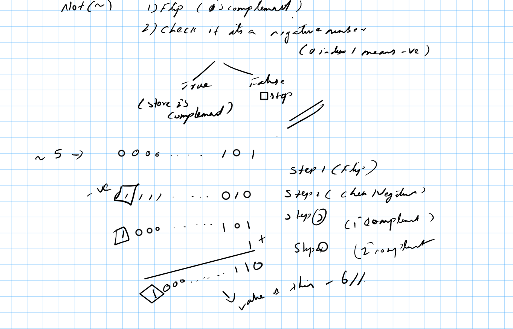
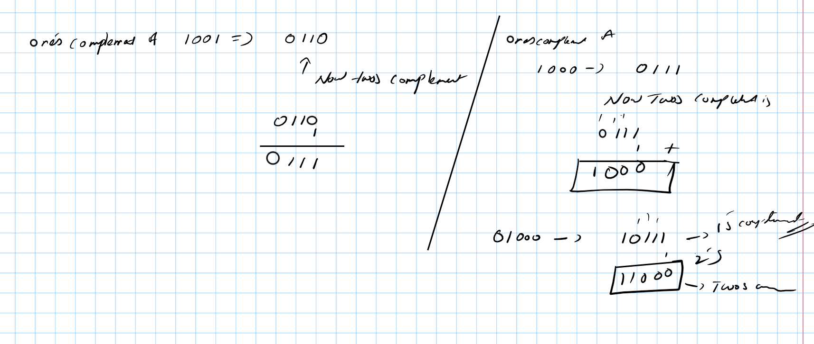

- &(AND) -> if bith 1 then 1 else 0
- | (OR) -> if any true then true else false
- (^)(XOR) -> if any one is 1 and not both then 1 else 0
- (>>)(Right SHift) -> 1101 >> gives us 110 (ie remove the last element) the formual could be x/(2^k)
    -- binary of 13 is 1101 , 13 >>1 gives us 110 we are right shifting by 1
```
package main

import (
	"fmt"
	"math"
)

func main() {
	fmt.Println(13 >> 3)

	fmt.Println(int64(float64(13) / math.Pow(float64(2), float64(3))))

}
```

- (<<)(Left Shift)

    we remove the first index at array and add 0 to the list, so left shift of 13 would be 11010
        formula would be num * (2^k)


```
// You can edit this code!
// Click here and start typing.
package main

import (
	"fmt"
	"math"
)

func main() {
	fmt.Println(13 << 3)

	fmt.Println(int64(float64(13) * math.Pow(float64(2), float64(3))))

}

```

- (~) Not operator in golang its is (^num) for two numbers ^ is XOR (5 ^3)

```

// You can edit this code!
// Click here and start typing.
package main

import (
	"fmt"
)

func main() {
	fmt.Println(^13)
	fmt.Println(^-13)

	fmt.Println(^1000)
	fmt.Println(^-1000)

}

```


to convert a number to negative takes 1'1 complement add 1 to it thats all, you get negative of it.

first bit tells us if its a negative of positive number, 1 at 0 index tells us negative and 0 at 0 ondex tells us its positive.

**one two compelemnt**
